# card4k


A clean, minimalist flashcard application built with Flutter. Master your learning with interactive pairing and selection modes, persistent local storage, and a beautiful, modern UI.

## Features

- **Interactive Learning Modes**: Practice with "Selection" (multiple choice) and "Pairing" (matching) game modes for effective memorization.
- **Local Database Storage**: Robust offline support using sqflite with pre-defined SQL schema scripts for managing groups and cards.
- **Real-time Progress Tracking**: Visual progress bars and detailed results pages showing correct pairs, mistakes, and performance metrics.
- **Group Management**: Create, edit, and delete custom flashcard groups with personalized color coding via flutter_colorpicker.
- **Persistent Settings**: Automatically saves your last used group and application preferences using shared_preferences.
- **Rich UI Components**: Custom SVG icons, smooth animations, and a modern dark-themed interface following Material Design principles.
- **Responsive Design**: Adapts beautifully to various screen sizes and orientations across mobile devices.

## Screenshots

No Groups
<p align="center">
	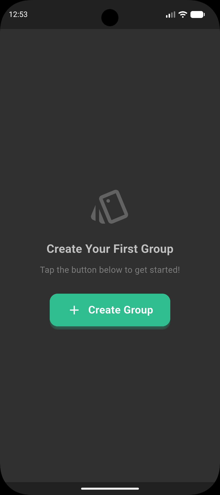
	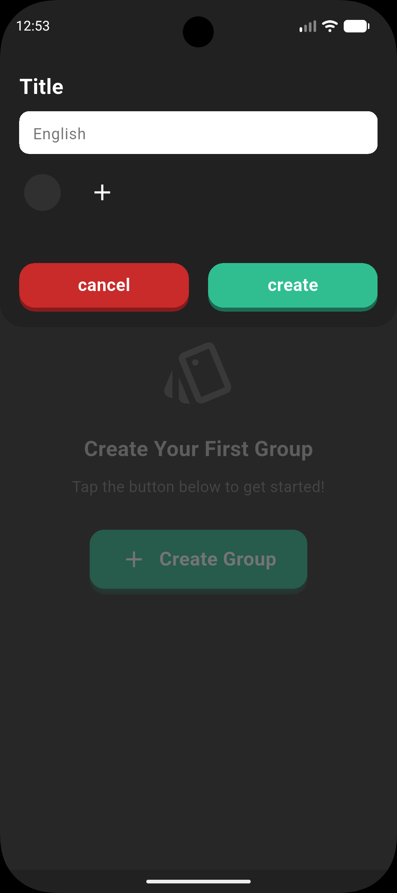
</p>

Home
<p align="center">
	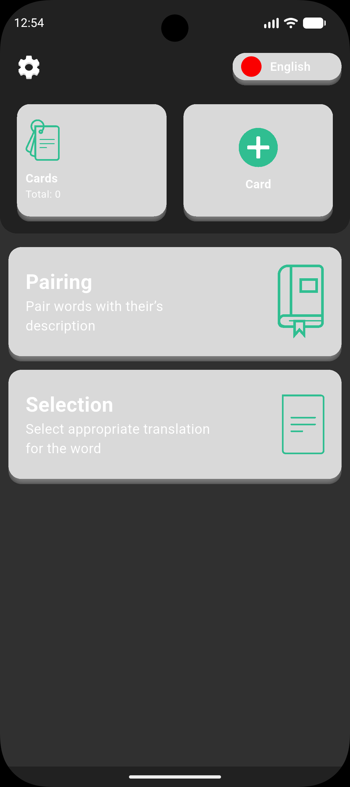
	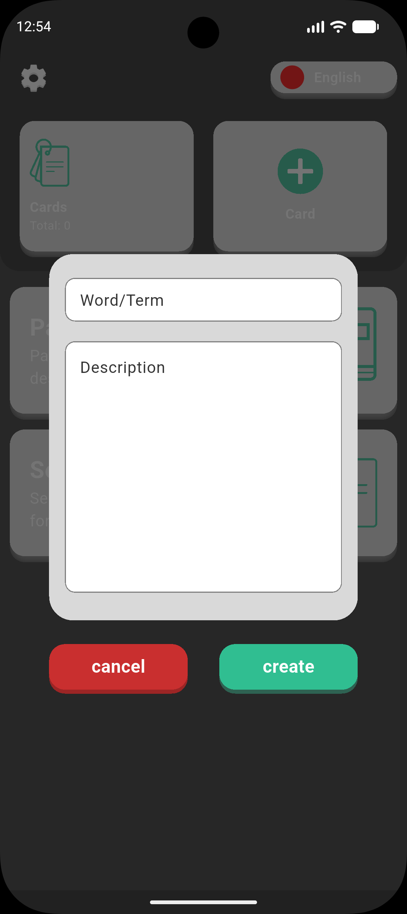
	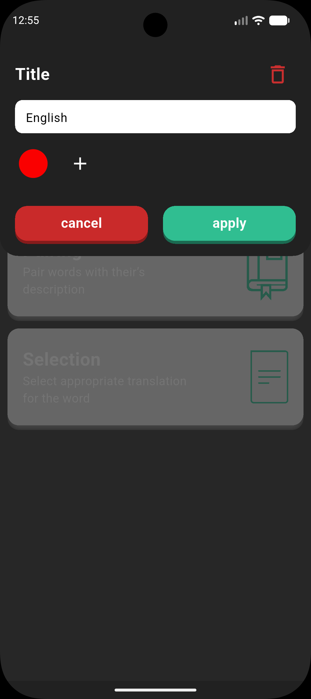
	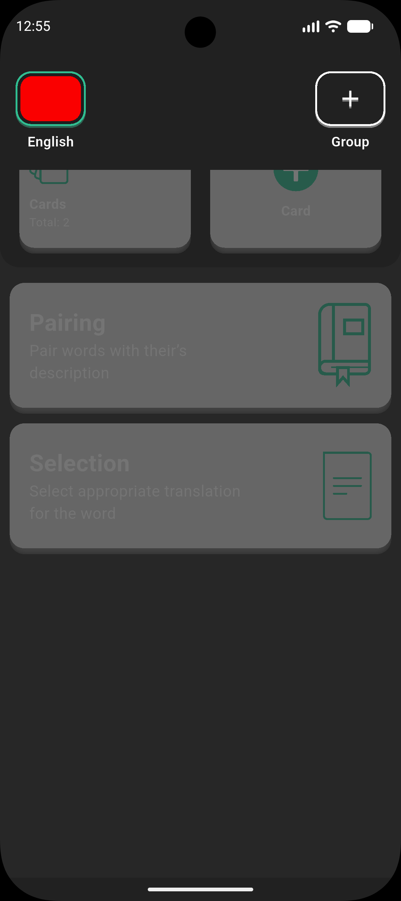
	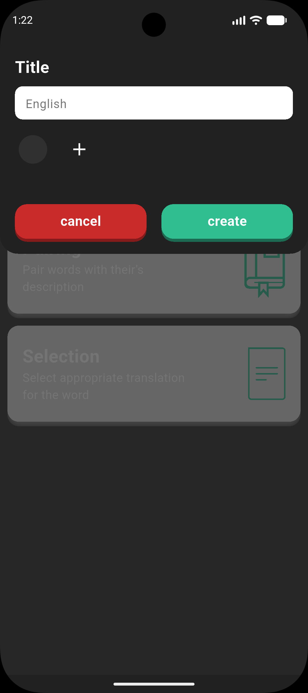
</p>

Cards
<p align="center">
	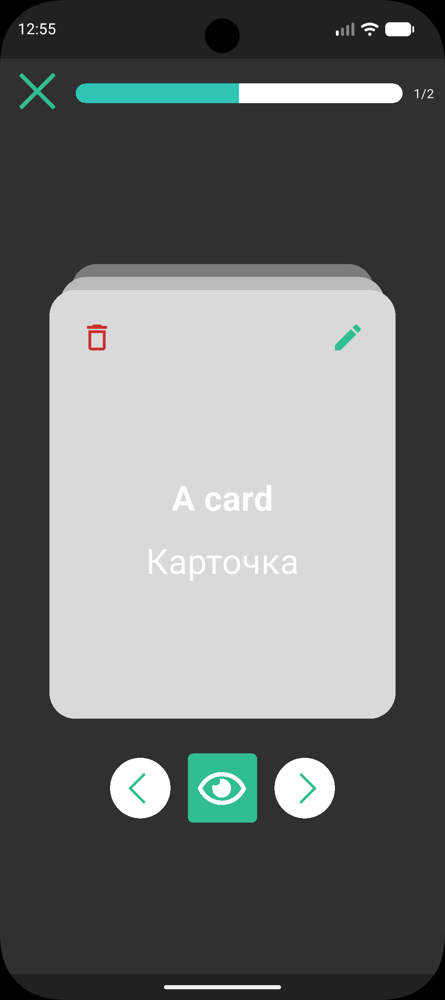
	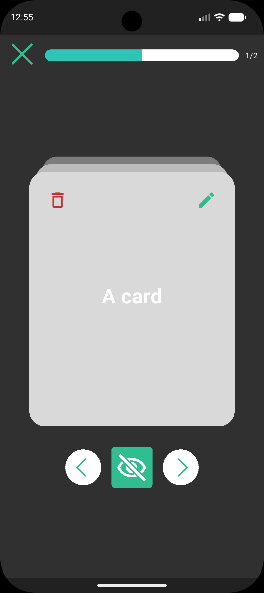
	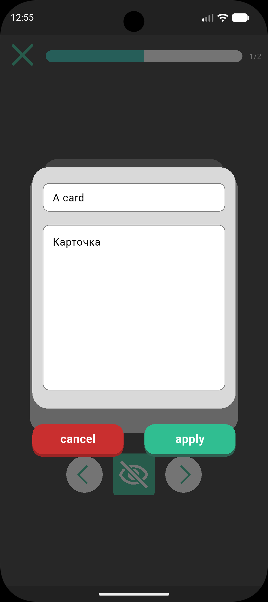
    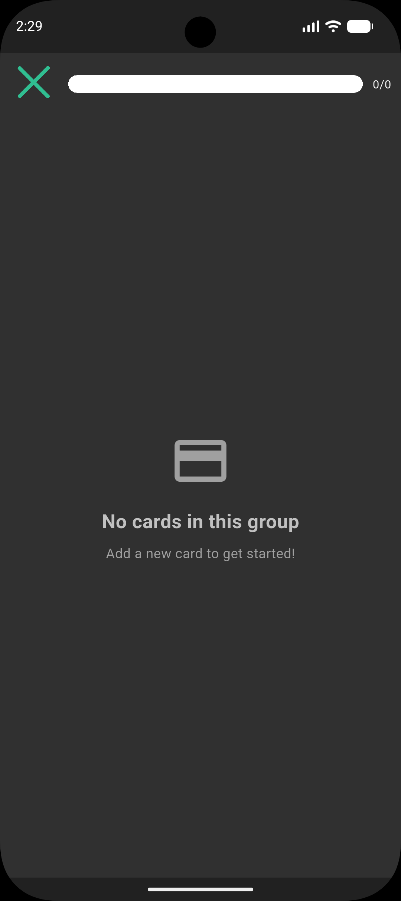
</p>

Pairing
<p align="center">
	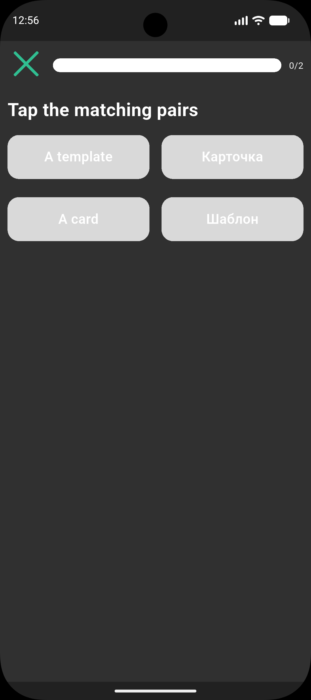
	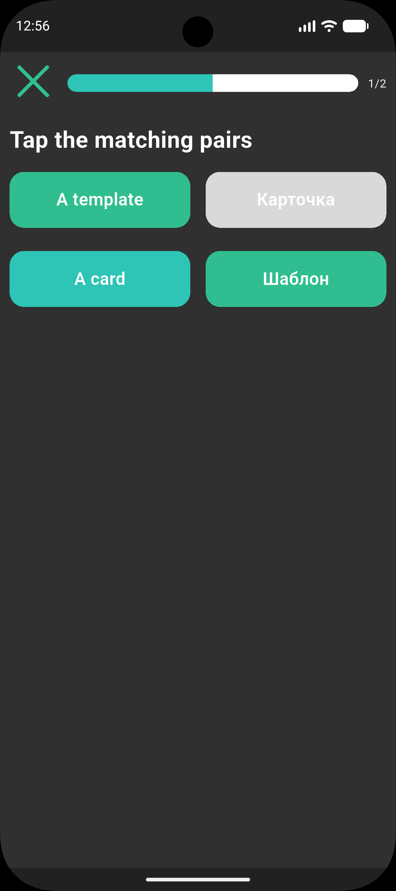
	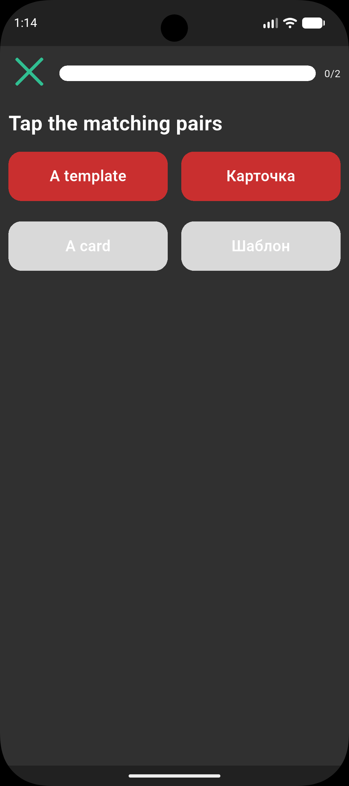
    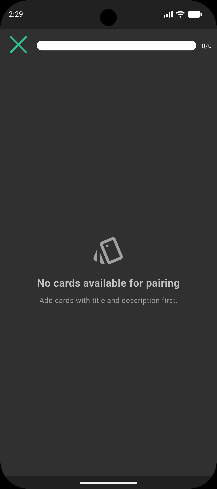
</p>

Selection
<p align="center">
	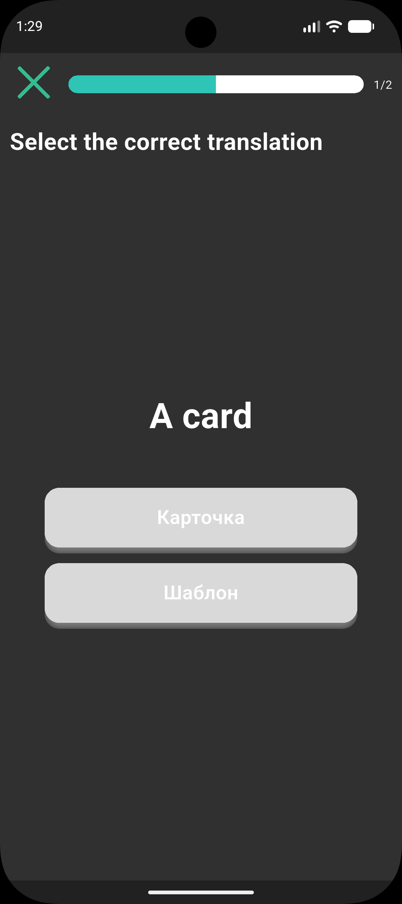
	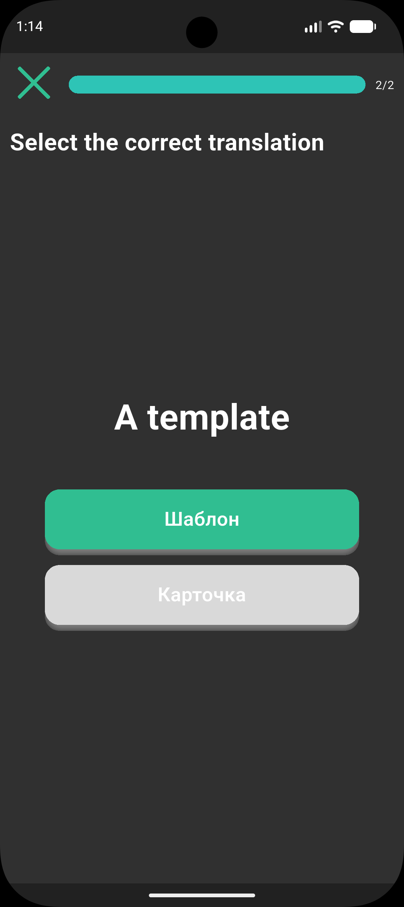
    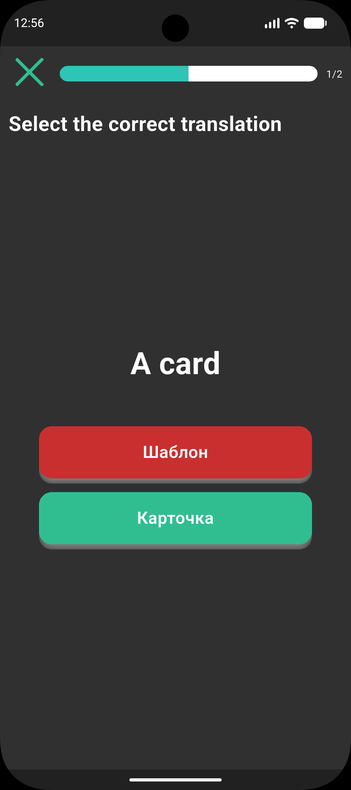
    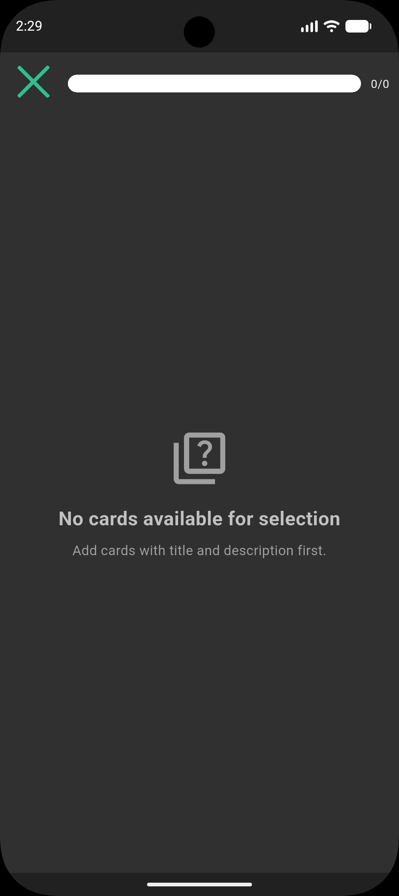
</p>

Results
<p align="center">
	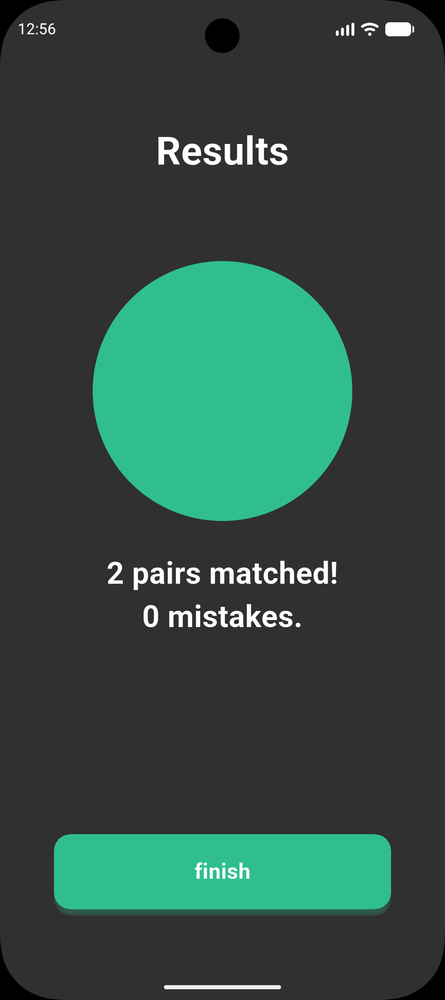
	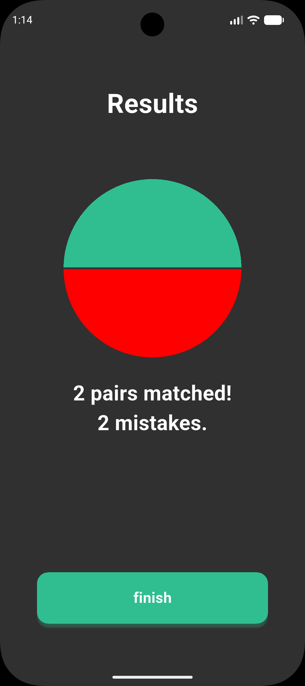
	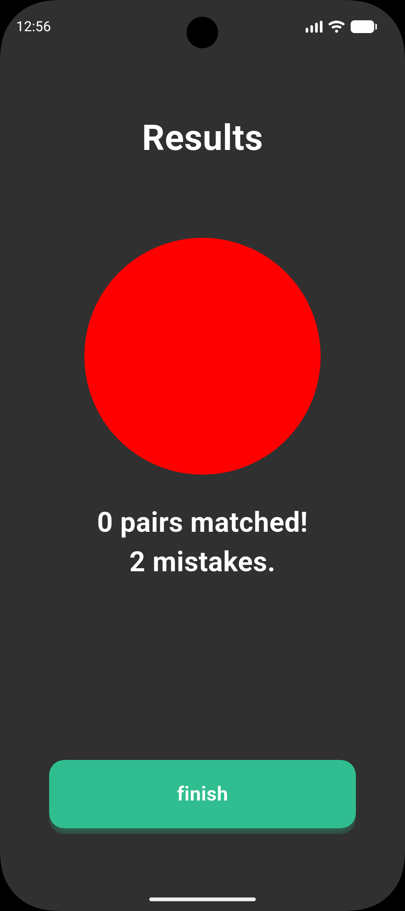
</p>

## Tech Stack

- **Framework**: Flutter 3.47.0
- **State Management**: Riverpod (`flutter_riverpod` ^3.4.2)
- **UI**: Material Design, Custom SVGs (`flutter_svg`), Color Picker (`flutter_colorpicker`)
- **Architecture**: Clean, modular structure with dedicated Notifiers, Repositories, and UI components.
- **Database**: `sqflite` with raw SQL asset scripts for schema and queries
- **Charting**: `fl_chart` (for performance visualization)
- **Storage**: `shared_preferences`, `path`

## Getting Started

### Prerequisites

- Flutter SDK (3.47.0 or higher)
- Dart SDK
- Android Studio / VS Code

### Installation

1. **Clone the repository**

```bash
    git clone https://github.com/your-username/card4k.git
    cd card4k
```

2. **Install dependencies**

```bash
    flutter pub get
```

3. **Run the app**

```bash
    flutter run
```

## Building for Release

### Android APK

```bash
    flutter build apk --release
```

### Android App Bundle (for Play Store)

```bash
    flutter build appbundle --release
```

## Project Structure

```text
    lib/
    ├── main.dart             # App entry point and ProviderScope initialization
    ├── models/               # Data models (Card, Group)
    ├── pages/                # UI screens (SelectionPage, PairingPage, ResultsPage, etc.)
    ├── providers/            # State management (GroupsNotifier, etc.)
    ├── data/                 # Repositories (sqlite_group_repository, etc.)
    ├── widgets/              # Reusable UI components
    ├── utils/                # Utility functions and constants
    └──assets/
    ├── icon/                 # SVG icons (settings, card, pairing, selection, etc.)
    └── sql/  
```

## Contributing

1. Fork the project
2. Create your feature branch (`git checkout -b feature/AmazingFeature`)
3. Commit your changes (`git commit -m 'Add some AmazingFeature'`)
4. Push to the branch (`git push origin feature/AmazingFeature`)
5. Open a Pull Request

## License

This project is licensed under the MIT License - see the [LICENSE](LICENSE) file for details.

## Acknowledgments

- Built with Flutter and Dart
- State management powered by Riverpod
- Database persistence powered by sqflite
- Charting powered by fl_chart
- Inspired by clean, minimalist design principles
- Powered by 4aika_M